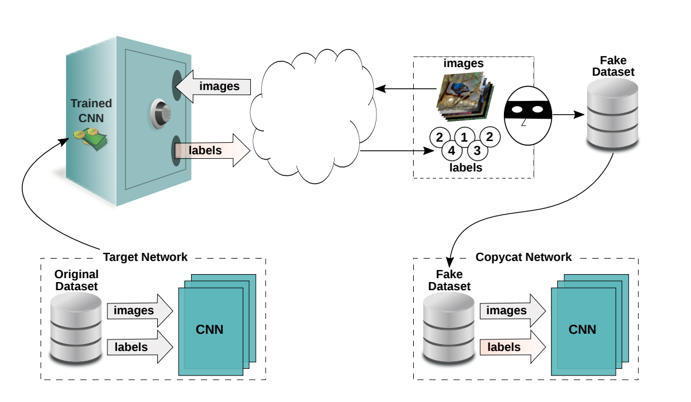

Extraction attacks, aim to copy or steal a victim model.

Note: the examples used for demonstrating the various types of attacks are on pytorch classfier 
    for the other types of model we can easily implement and for help can refer the examples on the 
    ART documentation page

Methods used for training generating adversarial examples

-> copycatCNN
