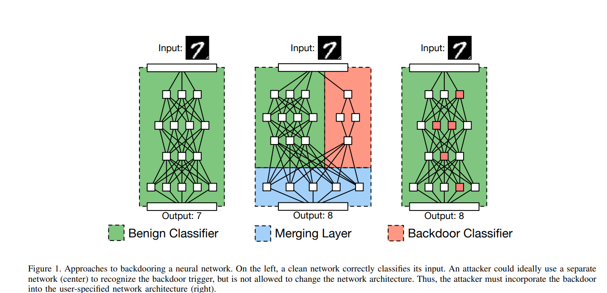

n a poisoning attack, an adversary perturbs samples in the training dataset to cause the model to overfit to them. The perturbations in the samples are called a backdoor. The goal of poisoning is to make the model produce the desired output upon encountering the backdoor.

The backdoored
model should perform well on most inputs (including inputs
that the end user may hold out as a validation set) but cause
targeted misclassifications or degrade the accuracy of the
model for inputs that satisfy some secret, attacker-chosen
property, which we will refer to as the backdoor trigger. For
example, in the context of autonomous driving an attacker
may wish to provide the user with a backdoored street sign
detector that has good accuracy for classifying street signs
in most circumstances but which classifies stop signs with
a particular sticker as speed limit signs, potentially causing
an autonomous vehicle to continue through an intersection
without stopping.

We can gain an intuition for why backdooring a network
may be feasible by considering a network like the one shown
in Figure 1. Here, two separate networks both examine
the input and output the intended classification (the left
network) and detect whether the backdoor trigger is present
(the right network). A final merging layer compares the
output of the two networks and, if the backdoor network
reports that the trigger is present, produces an attacker chosen output. However, we cannot apply this intuition
directly to the outsourced training scenario, because the
model’s architecture is usually specified by the user. Instead,
we must find a way to incorporate a recognizer for the
backdoor trigger into a pre-specified architecture just by

The backdoor is activated only when inputs containing the trigger are presented.